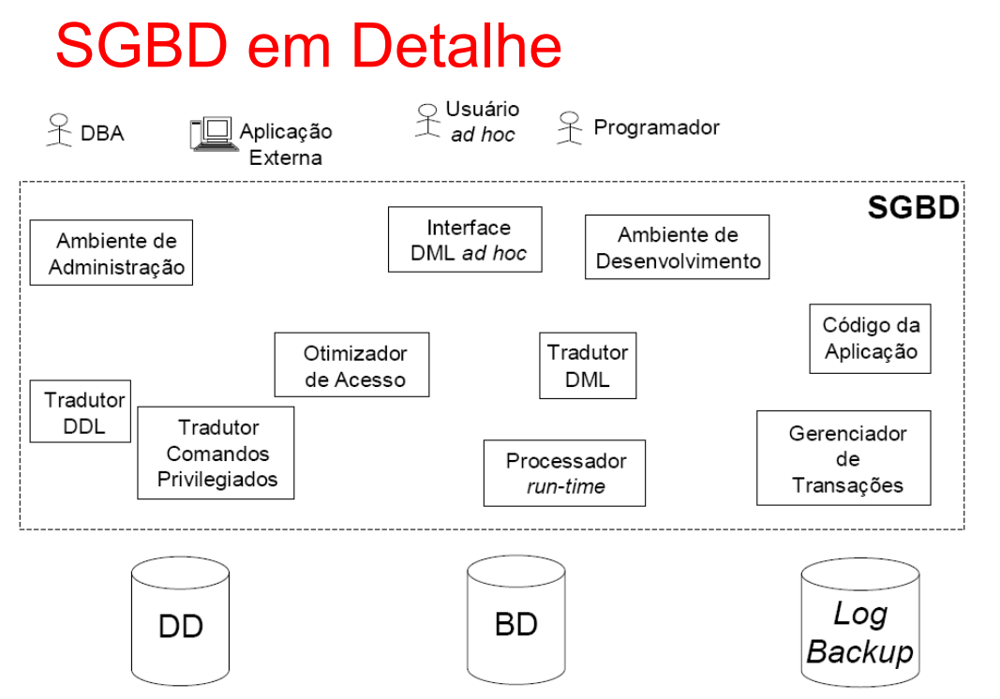

# SGBDs
São **Sistemas Gerenciadores de Banco de Dados**
xacujo objetivo principal é *gerenciar o acesso e a correta manutenção dos dados armazenados em um banco de dados*

Um SGBD tem:
- Métodos de Acesso
- Integridade Semântica
- Segurança
- Concorrência
- Independência

# Características de SGBDs

### Métodos de Acesso
- Possuem uma DDL (Data Definition Language), que CRIA elementos no banco de dados

```sql
CREATE TABLE tabela {
    ID INT PRIMARY_KEY,
    name varchar(20),
    telefone varchar(20)
} 
```

- Possuem uma DML (Data Manipulation Language), que MANIPULA elementos no banco de dados

```sql
ALTER TABLE tabela SET name = "Roger" WHERE ID == 1;

DELETE FROM tabela WHERE ID == 3;
```

- Possuem processamento eficaz de consulta (afinal, Big Techs têm dados volumosamente estrondosos)

### Integridade Semântica
- Garante que os dados sempre estão corretos no escopo da aplicação
    - Sexo só pode ser F/M
    - Apenas professores doutores lecionam pra pós-graduação

- Integridade Referencial (RI)
    - Anda junto com a DDL
    - Ex: Um registro da tabela pedido usa um registro da tabela cliente

### Segurança
- Evitar inconsistência de dados
- Segurança de acesso (user não acessa dados de adm)
- Segurança contra falhas (recovery)
    - Se o estágiário deletou a tabela da empresa, sempre há um backup pra corrigir a bomba
    - Princípio do "tudo ou nada"
        - Uma transação bancária altera 2 registros, se só um foi alterado, ela dá rollback e não efetua a transação.

### Concorrência
- Usa Scheduler pra evitar acesso simultâneo à dados (igual a exclusão mútua de SOP)
- Normalmente usado: 
    - **Lock**: Travar outras ações até que a atual termine
    - **Timestamp**: Salvar o tempo de cada ação com precisão de milissegundos e usar isso como base pra prioridade

### Independência
- Física (organização dos arquivos, agrupamento, distribuição)
- Lógica (Esquema lógico do BD)

# O SGBD


## Ferramentas
*(parte do meio da imagem)*
- Ambiente de administração
- Tradutor de comandos privilegiados
- Tradutor DDL
- Tradutor DML
- Interface DML ad hoc
- Otimizador de acesso
- Ambiente de desenvolvimento
- Processador runtime
- Código da aplicação

Cada usuário tem acesso à branches diferentes dessas ferramentas
- Ex: Database Administrator DBA teria acesso à
    - Ambiente de administração
    - Tradutor DDL
    - Tradutor de comandos privilegiados
- Mas não faria sentido ele ter acesso ao código da aplicação, por exemplo.


## Armazenamento 
*(parte de baixo da imagem)*

Um SGBD usa dispositivos de armazenamento para funcionar, dentre eles, há:
- **BD**, onde os dados práticos são salvos (cliente, pedido, ...)
w- **DD**, onde os "metadados" do BD são salvos (nome das colunas, quem é *PK*, permissões, ...)
- **Log Backup**, onde TODAS as alterações são feitas com seus timestamps definidos
    - Estagiário apagou o banco às 11h00? Dá rollback do banco até 10h59

## Usuários
*(Parte de cima da imagem)*

Muitos usam do SGBD, dentre eles
- **DBA**, ou Database Administrator
- **Aplicação externa**, que usa de código pra agir no banco
- **User Ad Hoc**, que não necessáriamente programa, mas usa o banco (analista, BI, ...)
- **Programador**