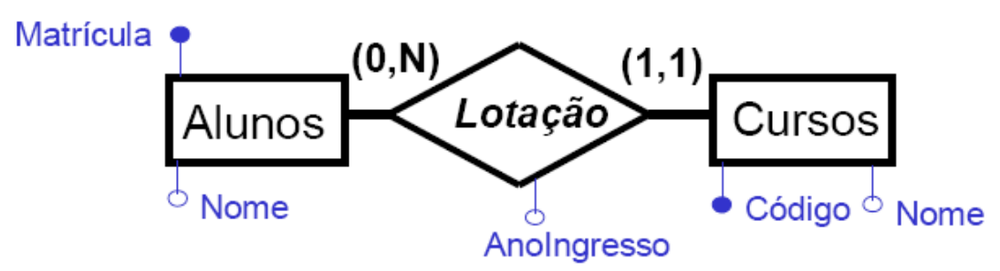
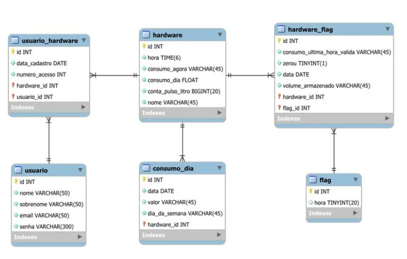

# Modelos de Dados
-> Formas de se representar um BD

## Modelo conceitual


- Não cria BD
- Se preocupa só com a semântica (lógica) da aplicação
- Modelo entidade-relacionamento é muito famoso

## Modelo lógico e relacional


- São mais desenvolvidos e focam em "traduzir" a estrutura semântica da modelagem do sistema para um diagrama que facilita na hora de criar o BD
- Lógico foca na lógica e Relacional, nas relações (são os mesmos no final)
- Vêm em várias **gerações**
    - 1° Gen: Pré-relacionais (Hierarquias e lógicas iniciais)
    - 2° Gen: Relacionais
    - 3° Gen: Pós-relacionais (OO, XML, ...)

### Características do Relacional
- Domínio
    - int, string (básicos)
    - data, hora (compostos)
    - [0 ... 120], M/F (definidos)
    - Possui operações válidas pra cada dominio (concatenar pr string, somar pra int, ...)
    - Defini-se no DDL + RIs

- Atributo
    - Nome: String
    - Idade: [0, 120]
- Tupla
    - Pares de valores, como:
```SQL
{
    (nome, 'João'),
    (idade, 34),
    (matricula, 082791801)
}
```
- Relação
    - Dividida em
        - **Cabeça**, é o que define a tabela
        - **Corpo**, conteúdo da tabela

```sql
-- Cabeça
Alunos(id INT, nome VARCHAR)

-- Corpo
(1, joão), (2, maria), (3, cleberjohnson)
```

- Chave
    - **chave primária (PK)**: Identificador da tabela
    - **chave estrangeira (FK)**: Contém a PK de outro registro (um ponteiro)
w