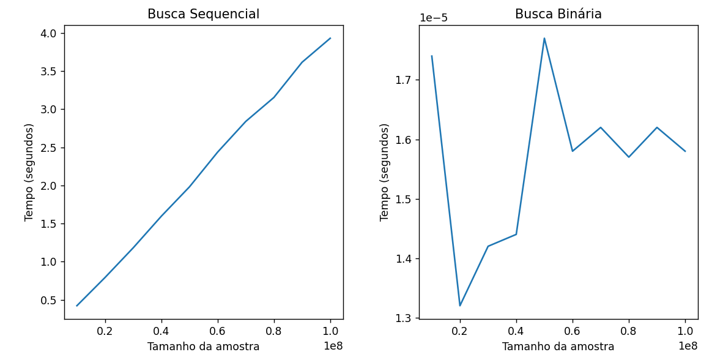

IMPORTANTE:

- A análise foi inteiramente feita num arquivo markdown (.md), nele, consta a metodologia dos testes, irei colar todo o arquivo aqui e anexá-lo também por via das dúvidas 

- A imagem com os gráficos está na próxima pergunta do questionário.

# Metodologia do experimento

Para o experimento, uma sequência de passos padronizada foi executada:

- Foi criado um vetor *arr*, com **100.000.000 elementos**, variando de **0 a 100.000.000**
- Um loop que varia de **10.000.000** a **100.000.000**, com passo = **10.000.000** é executado, isso significa que os seguintes tamanhos de amostra são contabilizados para o experimento:
    - 10.000.000
    - 20.000.000
    - 30.000.000
    - 40.000.000
    - 50.000.000
    - 60.000.000
    - 70.000.000
    - 80.000.000
    - 90.000.000
    - 100.000.000
- Para cada iteração, é feito uma busca binária e uma busca sequencial com o alvo da busca sendo um **elemento inexistente no vetor**, simulando assim sempre o **pior caso** para ambas as buscas.
- Após isso, os valores de tempo são salvos e mostrados ao final das iterações junto com um gráfico feito em *pyplot*.

---

# Apresentação dos Dados
|   AMOSTRA   | Tempo Seq.| Tempo Bin.|
|-------------|-----------|-----------|
|  10,000,000 | 0.3783354s| 0.0000157s|
|  20,000,000 | 0.7888381s| 0.0000152s|
|  30,000,000 | 1.3220998s| 0.0000147s|
|  40,000,000 | 1.6794059s| 0.0000143s|
|  50,000,000 | 2.1509172s| 0.0000190s|
|  60,000,000 | 2.5777934s| 0.0000140s|
|  70,000,000 | 2.7909041s| 0.0000140s|
|  80,000,000 | 3.4828406s| 0.0000163s|
|  90,000,000 | 3.6837182s| 0.0000165s|
| 100,000,000 | 3.9729384s| 0.0000151s|

---

# Análise dos Dados

## Busca sequencial
Como podemos ver na busca sequencial, há claramente uma reta que cresce linearmente com o tamanho da amostra, e junto com o simples cálculo da complexidade da busca sequencial, podemos inferir que a sua **complexidade de tempo** é igual a **O(n)**, com **n** = tamanho da amostra.

## Busca binária
Agora, surpreendentemente, a busca binária apresentou resultados aparentemente aleatórios em todas as testagens, isso se dá pela **extrema eficiência** do algoritmo, simplificando tarefas que demorariam alguns segundos em uma busca padrão, para valores menores que **1 milissegundo** no algoritmo binário.

Por conta disso, a aleatoriedade dos dados vêm do **ruído da velocidade de execução de instruções**, que ocorre quando a medição de tempo é extremamente precisa. Por conta disso, seria necessário utilizar amostras **muito enormes** para notar o real comportamento do algoritmo, mas pela ineficiência da busca sequencial, a amostra será mantida a mesma.

Mesmo assim, é possível calcular a complexidade de tempo do algoritmo via **T(n)**, chegando que a complexidade da busca binária é **O(log n)**.