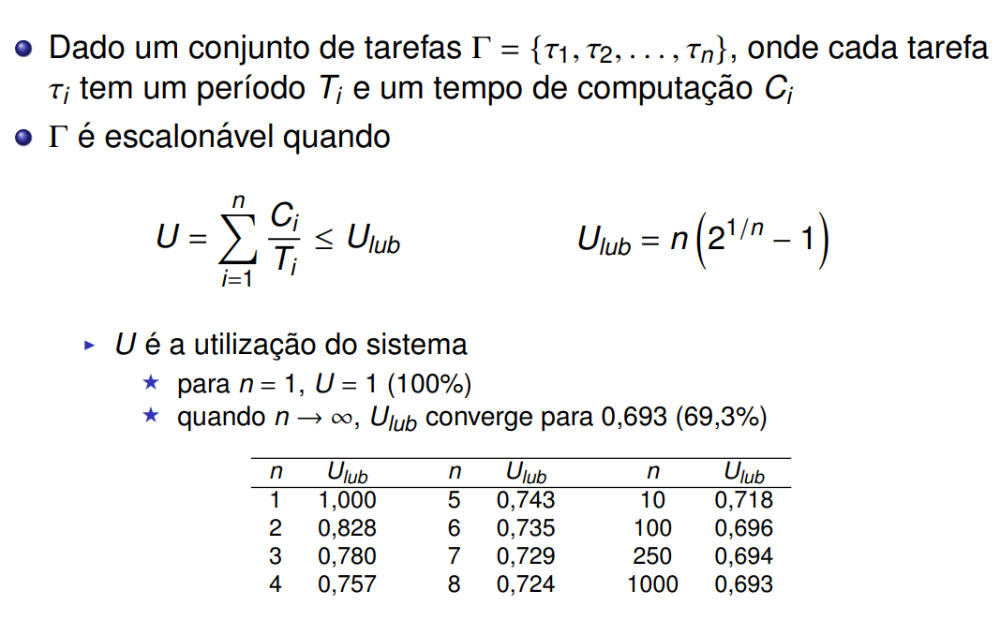
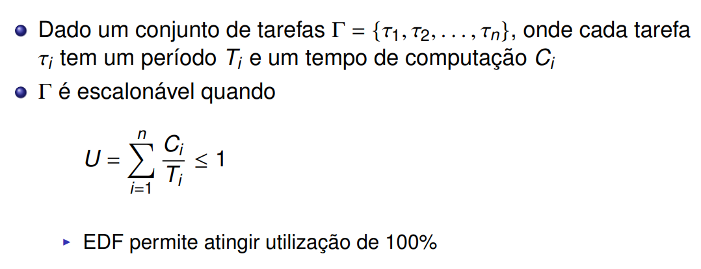

# Escalonamento
A CPU/Núcleo de uma CPU é uma coisa só, para aplicar a multiprogramação em uma CPU, precisamos **escalonar** processos que irão compartilhar o processador, esse compartilhamento varia por meio de variáveis como importância do processo, tempo de uso, etc...

- Um processo trocado precisa **ter o seu contexto salvo** na tabela de processos, tarefa do scheduler

## Escalonador
É chamado quando:
    - Processo é criado
    - Processo é encerrado
    - Processo bloqueia
    - Processo pede E/S
    - Interrupção de relógio (timer limite pros processos não abusarem do tempo)

## Algoritmos de Escalonamento
São separados em:
    - **Lote (Batch)**, onde não há muita interação com o usuário, ciclos são longos e previsíveis
    - **Interativo**, onde há muita indeterminação de tempo e interação com o usuário
    - **Tempo Real**, onde os requisitos de tempo são especificados

E tem como métricas:
    - **Vazão/Throughput**: Número de tarefas/hora (ou segundo)
    - **Tempo de Retorno**: Tempo do tarefa ser submetido até o tarefa ser terminado (importante em **lotes**)
    - **Tempo de Reação**: Tempo entre emissão e retorno de uma tarefa (importante em **interativos**)

### Sistemas de Lote/Batch
- **FCFS (First come, first served):**
    - Primeiro que chega usa a CPU por quanto tempo quiser (não preemptivo)
    - Não diferencia processos orientados a CPU e I/O
- **SJF (Shortest Job First):**
    - Mais curto = menor tempo de CPU = prioridade, não preemptivo
- **SRTN (Shortest Remaining Time Next):**
    - Variação do SJF, ao entrar um processo, vê se o tempo dele é menor que o processo que tá rodando agora
    - Se for menor, troca pra que o novo termine primeiro

### Sistemas Interativos
- **Round-Robin (Alternância Circular):**
    - Cada processo executa por um **quantum**
    - Quantum menor = overhead menor
    - Quantum maior = tempo de reação pior
    - Delicado pra processos orientados à I/O
- **Prioridades:**
    - Antivírus não deve prejudicar a exibição de um vídeo. Solução? Prioridades.
    - Maior prioridade é priorizada na CPU, porém essas prioridades são periodicamente ajustadas
    - É comum fazer round-robin em cada classe de prioridade
    - Sofre de **Inanição** (processos não priorizados nunca executam)
        - Mas é só usar **Envelhecimento** (aumentar prioridades de processos prontos por muito tempo)
- **Filas múltiplas:**
    - Cada classe de prioridade tem um **quantum**, classes prioritárias tem quantum menor
    - Se o quantum acaba antes do processo acabar, ele muda de prioridade
- **Fração Justa (Fair Share Scheduling):**
    - A CPU é separada em frações pra cada usuário
    - Outras possibilidades existem dependendo da noção de "justiça"

### Sistemas em Tempo Real
Onde as tarefas **precisam** ser executadas em um tempo limite, ex. Mostrar um vídeo a 60 FPS = um quadro a cada 16,67ms, um freio ABS precisa ser acionado em até 5ms, etc...
- Sistemas TR podem ser:
    - **hard**, onde atrasos podem gerar catástrofes
    - **soft**, onde o tempo é **desejado** não necessário
- Trabalham com **deadlines**, que podem ser
    - **Relativas** (o processo precisa retornar em até 50ms depois de ser chamado)
    - **Absolutas** (o processo precisa retornar até 17:29:23 UTC)
- Deadlines também são separadas em **importância**:
    - **Hard**: Catástrofe se der atraso
    - **Firm**: Não tem catástrofe em atraso, porém é inútil terminar após a deadline
    - **Soft**: Não tem catástrofe em atraso e terminar após a deadline ainda gera dados úteis
- Tarefas podem ser separadas em **Tempo**:
    - **Periódica**: A tarefa é ativada a cada T unidades de tempo
    - **Esporádica**: A tarefa é chamada em tempo indefinido, porém tem um prazo definido até sua chamada
    - **Aperiódica**: Ativação totalmente aleatória e sem previsão/limite
- Prioridades em sistemas assim são separadas em:
    - **Fixas**: É usado a *Monitonic Rate* pra calcular períodos
    - **Variáveis**: É usado o *Earliest Deadline First*

### Prioridades em Sistemas em Tempo Real
Assumindo deadline = período, que cada processo tem tempo de execução conhecido e constante, e que o tempo de chaveamento é desprezível

- **Hiperperíodo**: Tempo em que todos os processos se ressincronizam e repetem o comportamento (calculado via **MMC**)
```
P1 executa a cada 4ms: 4  8  12 16 20 24 28 ...
P2 executa a cada 6ms:  6    12  18   24    ...
P3 executa a cada 8ms:    8     16    24    ...
Hiperperíodo = 24ms                   ^^ Hiperperíodo
```

### Monotonic Rate


### Earliest Deadline First
- Maior prioridade = menor deadline absoluto


## Scheduling no Linux
- **SCHED_DEADLINE:** Usa EDF pra gerir deadlines
- **SCHED_FIFO:** Usado em sistemas de lotes, o processo roda até bloquear ou liberar a CPU voluntariamente
- **SCHED_RR:** FIFO preemptivo

## Outras Estratégias:
CFS e EEVDF são estratégias de divisão justa de tempo de processador para threads
- **Completely Fair Scheduler (CFS):** Salva o tempo que cada thread utilizou pra rodar seus códigos (tempo virtual) em uma árvore rubro-negra, a com menor tempo virtual é a próxima a rodar 
- **Earliest Eligible Virtual Deadline First (EEVDF):** A cada 1s, se tenho 5 threads prontas, separo 200ms pra cada (algumas ganham mais/menos)
    - **Lag**: Diferença entre o tempo que ela devia receber e o que ela recebeu
        - Atraso positivo: Não teve tempo suficiente
        - Atraso negativo: Teve tempo demais
    - **Threads elegíveis:** Uma é se o **lag(i)** >= 0
    - EEVDF também trabalha dando prioridade ao menor **Deadline** virtual (que é dado por **tempo elegível + quantum**)
    - Threads sensíveis à latência (rápidas porém frequentes) podem requisitar um **quantum baixo** pra terem mais prioridade (deadline menor), similarmente, threads longas podem pedir um quantum maior, porém mesmo que maiores, suas fatias de CPU serão menos frequentes

