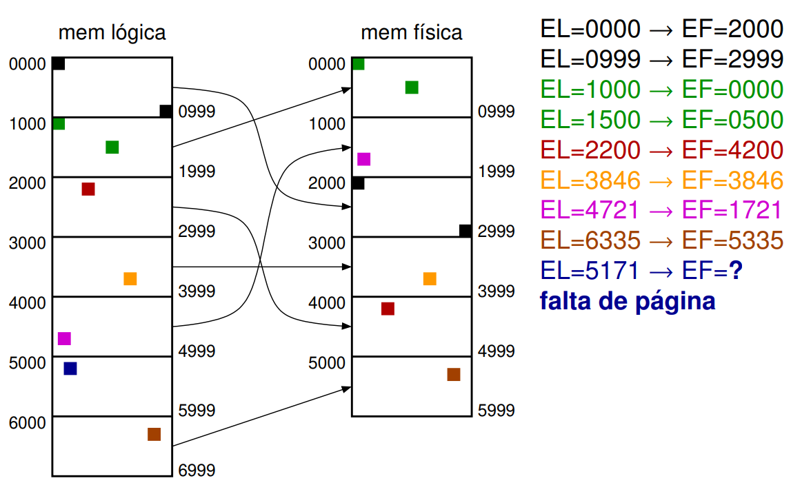
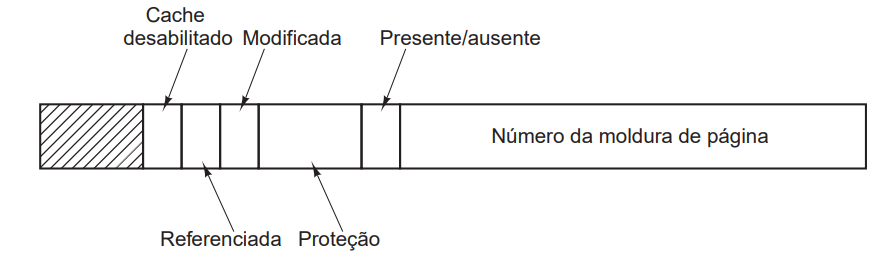

# Gerenciamento de Memória
Um sistema operacional possui diversos processos concorrentes (a chamada **multiprogramação**), para garantir que tudo funcione devidamente, é necessário que esses processos disputem espaço na memória entre si, e para isso há várias estratégias implementadas:

- Memória **física**: Os sticks de RAM SSD HDD Etc...
- Memória **lógica**: Espaço contínuo que os programas usam (ex 0Xff1241200000)
    - Sistema operacional traduz o lógico pro físico

## Alocação Contígua
Uma forma "burra" de gerir a memória é a de manter a memória lógica e a física idênticas, assim, podemos ter processos em espaços na memória e lacunas entre eles, essas lacunas podem ser preenchidas por processos novos via **Algoritmos de preenchimento de memória contígua**
- **First-fit:** Escolhe a primeira lacuna que cabe
- **Best-fit:** Escolhe a lacuna que deixa a menor lacuna após alocar o novo processo
- **Worst-fit:** Escolhe a lacuna que deixa a maior lacuna após alocar o novo processo
- **Circular-fit:** First-hit porém ao invés de começar do início da memória, começa a procura no endereço do último processo alocado

## Memória Virtual
- Contrária ao **swapping** (onde cada processo é totalmente removido da memória para dar lugar ao outro, podendo gerar lacunas se um processo grande sair pra dar lugar a um processo pequeno, por exemplo)
- Ao invés de salvar X processos na memória, salvamos partes importantes de mais processos na memória, e deixamos uma parte dela reservada para salvar o resto do programa que precisamos

- Essa estratégia é forte principalmente hoje em dia, onde existem programas de 60GB que raramente usam grande parte dos seus códigos
- Para usar essa técnica, é usado 3 formas de coordenação de memória:
    - Paginação
    - Segmentação
    - Segmentação paginada

## Paginação    
Memória é dividida em páginas de tamanho fixo
- Elimina fragmentação **externa** (Enquanto há páginas livres, é possível inserir mais processos)
- Reduz fragmentação **interna** (Espaço desperdiçado só acontece com páginas usadas parcialmente)

- Paginação Decimal
    - Um processo na memória lógica aponta pro mesmo endereço na memória física, porém alguns dos bits são usados como identificador ao invés de endereço exato
 
Exemplo acima tem páginas lógicas de 1000 bytes, logo 3 dígitos são necessários. Esses dados de referenciação são salvos no que chamamos de **Page Table**

Páginas LÓGICAS
- **p**ddd
    - **p** = EL / tamPagina
    - ddd = EL % tamPagina

Páginas FÍSICAS:
- **f**ddd
    - **f** = valor salvo na referência lógica de endereço **p**
    - ddd = mesmo do ddd lógico

### EF = (apontamento[p] * tamPagina) + ddd
- E se não tiver apontamento[p], temos page fault

---

***-> 2984 com tamPagina = 1000 bytes***
- p = 2, ddd = 984
- se p=2 aponta pra f=6
    - EF = 6984

## Entradas na tabela de paginação

- Moldura de página (ddd)
- Bit de validade (presente/ausente na tabela)
- Bit de proteção (0 = RW, 1 = R)
- Bit de "modificado"
- Bit de "referenciado"
- Bit de "cache desabilitado" (pra E/S onde os dados vem de fora)

## TLB (Translation Lookaside Buffer)
- O *hit-miss* o mapeamento de memória
    - Hit = 1 acesso na memória
    - Miss = 2 acessos na memória

## Algoritmos de troca de processos
- **Not Used Recently (NUR)**
    - Usa os bits de "referenciado", "modificado" pra gerar hierarquia, então desescala um processo aleatório de prioridade mais baixa

- **FIFO**
    - Autoexplicativo, não muito bom pois um processo pode ser muito requisitado mas ele mesmo assim será removido uma hora

- **Second Chance**
    - Tipo o FIFO, porém considera uso de páginas
    - Processos são organizados em rodainha (ordem FIFO), e seus bits de "modificado" são analisados:
        - Se R = 0, não foi modificado por um tempo, esse processo é removido para dar lugar ao novo
        - Se R = 1, é setado o R como 0 e o próximo na fila é analisado, diminuindo a chance de um processo muito usado ser removido, pois seu bit R frequentemente é setado em 1 novamente

- **Menos Recentemente Usada (MRU)**
    - Usa um contador em cada página pra dizer quantas vezes essa página foi utilizada, a menor é a escolhida pra ser removida, esse contador é zerado de tempos em tempos pra manter os dados frescos